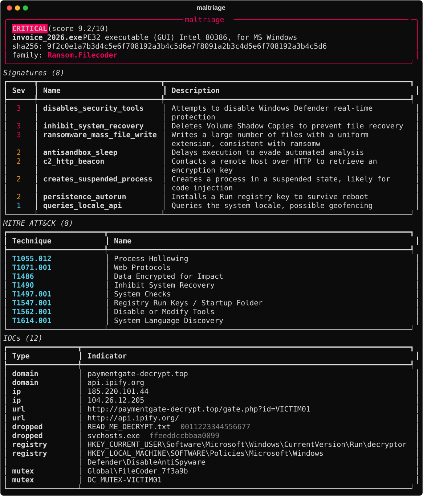

# 🧬 maltriage

> Triage a malware **sandbox report** in one command. Point it at a CAPE / Cuckoo `report.json` and it returns a scored **verdict**, the fired **behavioural signatures**, a resolved **MITRE ATT&CK** mapping, and every extracted **IOC** — ready to paste into a ticket or feed into automation.

After a sandbox detonates a sample it spits out a huge JSON report. Reading it by hand is slow and easy to get wrong. `maltriage` does the boring first pass: it distills that report into *"how bad is this, why, and what should I block?"* — offline, in milliseconds.



---

## ✨ Features

- **Verdict + score** — normalises CAPE's `malscore` (0–10) onto a `CLEAN / LOW / MEDIUM / HIGH / CRITICAL` ladder. No malscore? It derives one from signature severities.
- **Signatures** — every behaviour the sandbox flagged, ranked by severity.
- **MITRE ATT&CK** — resolves the techniques behind the signatures to technique names + links, using a **bundled** ATT&CK map (no network calls).
- **IOC extraction** — domains, IPs, URLs, dropped files (with hashes), registry keys and mutexes, all deduplicated.
- **Process tree** — parent/child processes and command lines (think `vssadmin delete shadows`).
- **Four outputs** — rich **console**, **Markdown** (for tickets), a standalone **HTML** report, and **JSON** (for SOAR / to feed [IOC Hunter](https://github.com/defamp/ioc-hunter)).
- **Pipeline-friendly** — exits `1` on `HIGH`/`CRITICAL` so it can gate an automated workflow (`--no-fail` to disable).
- **CAPE *and* Cuckoo** — reads whichever schema it's given, defensively (a truncated report yields fewer IOCs, never a crash).
- **No external services or API keys** — 100% offline, standard library + `rich`.

## 🚀 Installation

```bash
git clone https://github.com/defamp/maltriage
cd maltriage
pip install -e .
```

Requires Python 3.8+. The only runtime dependency is [`rich`](https://github.com/Textualize/rich).

## 🧪 Usage

```bash
# Pretty console triage
maltriage report.json

# Markdown for a ticket
maltriage report.json -f md -o triage.md

# Standalone HTML report
maltriage report.json -f html -o triage.html

# JSON for automation / SOAR
maltriage report.json -f json

# Just the indicators, to pipe into a blocklist or IOC Hunter
maltriage report.json -f json --iocs-only | jq '.domains[]'

# Only show severe signatures
maltriage report.json --min-severity 3
```

Try it right now against the bundled example:

```bash
maltriage samples/report.json
```

### Options

| Flag | Description |
| --- | --- |
| `-f, --format {term,md,html,json}` | Output format (default `term`). |
| `-o, --output FILE` | Write to a file instead of stdout. |
| `--min-severity N` | Only show signatures with severity ≥ N. |
| `--iocs-only` | With `-f json`, emit just the IOC block. |
| `--no-fail` | Always exit `0` (don't signal verdict via exit code). |

### Exit codes

| Code | Meaning |
| --- | --- |
| `0` | Triaged; verdict below `HIGH` (or `--no-fail`). |
| `1` | Verdict is `HIGH` or `CRITICAL`. |
| `2` | Input error (file missing / not a sandbox report). |

## 🧩 Where it fits

`maltriage` is the reporting half of a home malware-analysis workflow:

```
sample ─▶ CAPE/Cuckoo sandbox ─▶ report.json ─▶ maltriage ─▶ verdict + IOCs ─▶ ticket / blocklist / IOC Hunter
```

It pairs with the rest of the toolkit — [IOC Hunter](https://github.com/defamp/ioc-hunter) (enrich the IOCs it extracts), [LogSleuth](https://github.com/defamp/logsleuth) and [PhishTriage](https://github.com/defamp/phishtriage).

## 🏗️ How it works

```
report.json ─▶ parser.py   normalise CAPE/Cuckoo schema → data model
            ─▶ analyzer.py  verdict, rank signatures, resolve ATT&CK
            ─▶ report.py    render term / md / html / json
```

Each stage is independently testable; see `tests/`.

## ✅ Tests

```bash
pip install -e ".[dev]"
pytest
```

## ⚠️ Disclaimer

`maltriage` only *reads* sandbox output — it never executes samples. Detonate malware only inside an isolated sandbox you control.

## 📄 License

MIT © Defa Mulya Pratama
